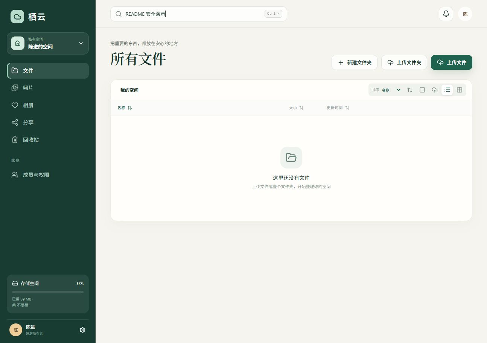
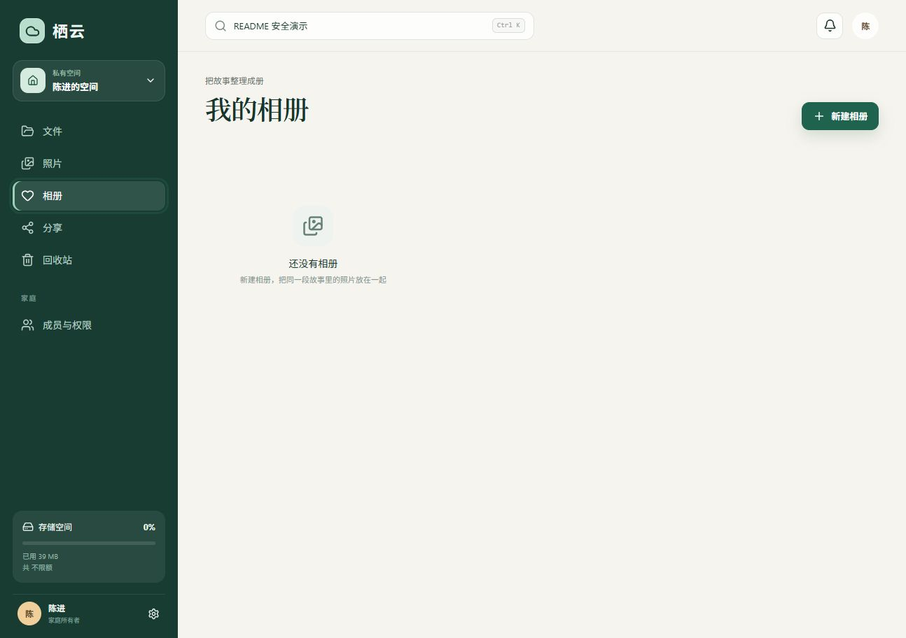
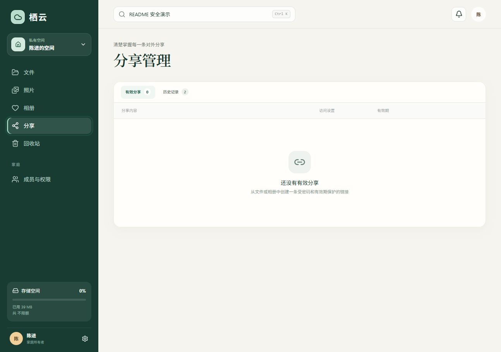

# 栖云家庭网盘

栖云是一个 Go + React + PostgreSQL + RustFS 实现的自托管家庭网盘。每位成员拥有通过应用权限隔离的私有空间，同时可以在家庭空间内按目录授予查看、编辑或管理权限。

## 功能介绍

栖云把传统网盘、照片时间线和家庭共享放在同一个私有部署中：文件继续按目录管理，照片会自动提取拍摄时间并进入时间线，也可以整理到相册；家庭成员之间通过明确的目录和相册权限协作，管理员无法越权浏览成员私有空间。

### 文件与上传

- 文件夹、文件上传、下载、移动、重命名、批量操作、回收站和空间配额
- 浏览器直传 RustFS，小文件预签名 PUT，大文件 Multipart 分片上传
- 文件夹上传层级保留、批量同名保留两份、上传进度和失败重试状态
- 流式 ZIP 文件夹下载，不在 API 容器落盘
- 常见图片、音视频、纯文本及 PDF 在线预览；HTML、SVG 等主动内容和未知格式安全回退到下载

### 照片与相册

- JPEG、PNG、WebP、GIF、HEIC/HEIF 照片时间线、EXIF 和两档 WebP 缩略图
- 相册内直接上传照片，照片同时进入按拍摄时间排列的总时间线
- 相册详情、照片大图查看、备注编辑以及原图下载

### 分享、权限与账户

- 用户名密码登录、首次初始化、一次性成员邀请、管理员密码重置和登录设备管理
- 私有空间与家庭空间隔离，家庭目录权限继承及中断继承
- 文件和相册密码分享、有效期、撤销、访问历史和审计记录
- 个人资料与密码修改、成员角色调整、家庭空间配额和文件/相册权限编辑
- 当前会话识别、其他登录设备退出以及密码变更后的会话失效
- 响应式桌面/手机界面

## 界面截图

### 文件管理



| 相册管理 | 分享管理 |
| --- | --- |
|  |  |

## 快速启动

1. 复制 `.env.example` 为 `.env`，替换 PostgreSQL 与 RustFS 的示例密码。
2. 在项目目录执行：

   ```bash
   docker compose up --build -d
   ```

3. 打开 `http://localhost`，首次访问会引导创建家庭与所有者账号。

PostgreSQL、RustFS API 和管理控制台默认仅绑定到 `127.0.0.1`，不会暴露到局域网。RustFS API 位于 `http://localhost:9000`，管理控制台位于 `http://localhost:9001`。

基础 compose 固定 RustFS 的发布版本以获得可复现的本机开发环境。它不应直接用于公网生产环境。

## 公网部署

- 将 `PUBLIC_BASE_URL` 改为实际 HTTPS 地址，`SITE_ADDRESS` 改为域名，并设置 `COOKIE_SECURE=true`。
- 给 Web/API 域名及 `S3_PUBLIC_ENDPOINT` 对应的对象存储域名配置 TLS。
- RustFS 桶 CORS 仅允许 `PUBLIC_BASE_URL`；不要开放公共桶权限。
- 使用生产覆盖文件固定经过验证的 RustFS 版本：

  ```bash
  docker compose -f compose.yaml -f compose.production.yaml up --build -d
  ```

- 升级 `RUSTFS_VERSION` 前先在隔离环境完成备份恢复和上传下载回归。

预签名 URL 中的主机名必须能被用户浏览器访问，所以 `S3_ENDPOINT` 使用容器内地址，而 `S3_PUBLIC_ENDPOINT` 使用浏览器可访问的地址。

## 设备部署

设备上使用设备覆盖文件，把 RustFS 数据放到机械盘，并避开已有对象存储的 9000/9001 端口：

```bash
docker compose -f compose.yaml -f compose.production.yaml -f compose.device.yaml up --build -d
```

设备 `.env` 中把 `PUBLIC_BASE_URL`、`SITE_ADDRESS` 和 `S3_PUBLIC_ENDPOINT` 设为同一个局域网入口（例如 `http://192.168.1.19`）。Caddy 通过 `/pan-objects/*` 代理签名对象请求，页面、上传和下载共用一个端口；9100 与 9101 仅绑定回环地址。`compose.device.yaml` 会把 RustFS 数据绑定到 `/srv/qiyun-drive-rustfs`。设备部署用机械盘上的独立 ext4 镜像挂载该目录，使以整个 `/mnt/data` 为数据根的宿主机 RustFS 只能看到普通镜像文件，无法扫描栖云实例的数据树。

## 本地开发

前端：

```bash
npm install
npm run dev
```

后端需要 Go 1.26.6 或更高补丁版本，以及可访问的 PostgreSQL 和 RustFS：

```bash
cd backend
go run ./cmd/api
go run ./cmd/worker
```

主要配置参见 `backend/internal/config/config.go`。数据库迁移会由 API 在启动时自动执行；无效布尔值、时长、URL、安全 Cookie 或占位密钥会让进程明确拒绝启动。

项目已为国内网络默认启用 npm 镜像（`.npmrc`）和 Go 模块代理（本地 `GOPROXY` 及后端镜像构建参数），重新安装依赖或构建容器时会自动使用；如需改回官方源，可覆盖对应的 registry 或 `GOPROXY`。

## 数据与备份

需要同时备份 PostgreSQL 与 RustFS 数据：

- PostgreSQL 保存账号、权限、目录、相册、分享和对象元数据。
- RustFS 保存原始文件和派生缩略图。
- 回收站内容仍计入配额，默认 30 天后由 Worker 永久清理。

设备上使用 `sh scripts/backup.sh`，会识别实际 RustFS 挂载，同时保存数据库、对象、配置、镜像及 SHA-256 清单。设备对象目录为 `/srv/qiyun-drive-rustfs`，底层镜像文件位于 `/mnt/data/.qiyun-drive-storage.img`。Windows 异机复制使用 `scripts/collect-backup.ps1`；`scripts/restore-latest.sh` 在独立存储恢复整套服务并校验抽样文件。备份写入冻结期间网盘入口短暂不可用。

账户设置中的“登录安全”支持可选动态码二次验证、一次性恢复码和安全事件。部署前生成并备份 `MFA_ENCRYPTION_KEY`（64 位十六进制），它用于加密账户密钥；已开启二次验证后不能随意更换或丢弃该配置。恢复码只展示一次，应离线保存。

上传先进入暂存对象，校验大小与 SHA-256 后发布到新的正式路径。刷新后续传只保存元数据、摘要及分片进度，大文件需要重新选择原文件；系统核对内容后只补传缺失分片。照片时间线支持游标分页和虚拟列表。家庭所有者可在“成员与权限”查看后台任务、磁盘、备份及恢复状态。

完整的发布检查、备份恢复、监控和故障处理见 [运维手册](docs/operations.md)。

## 质量检查

前端完整检查：

```bash
npm run check
```

后端完整检查：

```bash
cd backend
go test ./...
go vet ./...
```

GitHub Actions 会额外启动一次性 PostgreSQL 与 RustFS，运行真实 API 权限、会话、分享和批量列表集成测试。

## 安全边界

- RustFS 桶始终私有，只有 API/Worker 持有长期密钥。
- 文件访问必须先通过空间与 ACL 权限判断，再签发短期 URL。
- 管理员权限只覆盖成员管理和家庭空间，不覆盖成员私有空间。
- 密码使用 Argon2id，登录会话和分享令牌只保存 SHA-256 哈希。
- 未授权资源返回 404，减少资源 ID 探测。
- 上传内容默认不受信任：可内联预览的格式使用显式白名单，HTML、SVG 等主动内容只能下载。
- Web、API 与后台任务容器使用非 root/最小权限运行，图片处理任务另有进程与内存边界。
- 最近一次全量审计的范围、修复项与剩余部署边界见 [安全审计报告](docs/security-audit.md)。

当前 v1 不包含原生同步客户端、文件版本、视频转码、AI 人脸识别、Office 在线编辑和端到端加密。

## 单端口部署与安全边界

单端口对象代理的配置见 [运维手册](docs/operations.md)，上传和权限变更的提交规则见 [事务一致性约定](docs/transaction-consistency.md)。

FRP 只需转发网盘入口；无需转发 9100、9101、5432 或 SSH。公网 HTTP 即使经过加密的 FRP 隧道，浏览器到公网入口仍是明文，不能保证密码、Cookie 和文件传输安全。配置校验仍拒绝公网 HTTP，不会自动降级。内网入口当前使用 HTTP。

“私有空间”属于应用授权隔离，不是端到端加密；宿主机 root、数据库管理员或有权重置账号凭据的人不属于这一保密边界。
